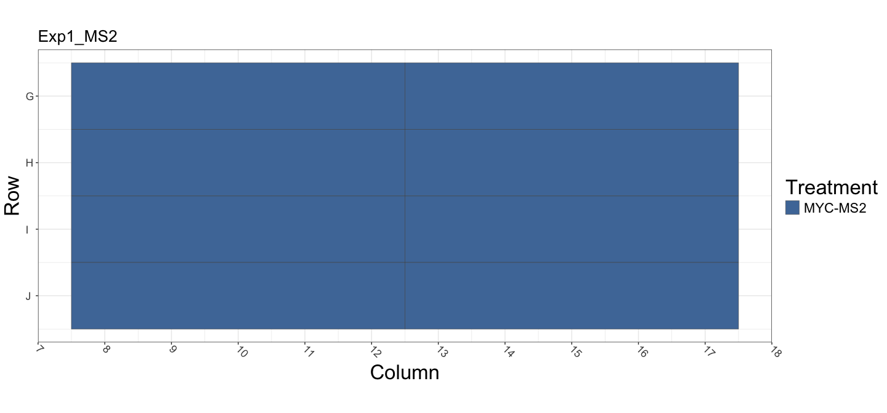
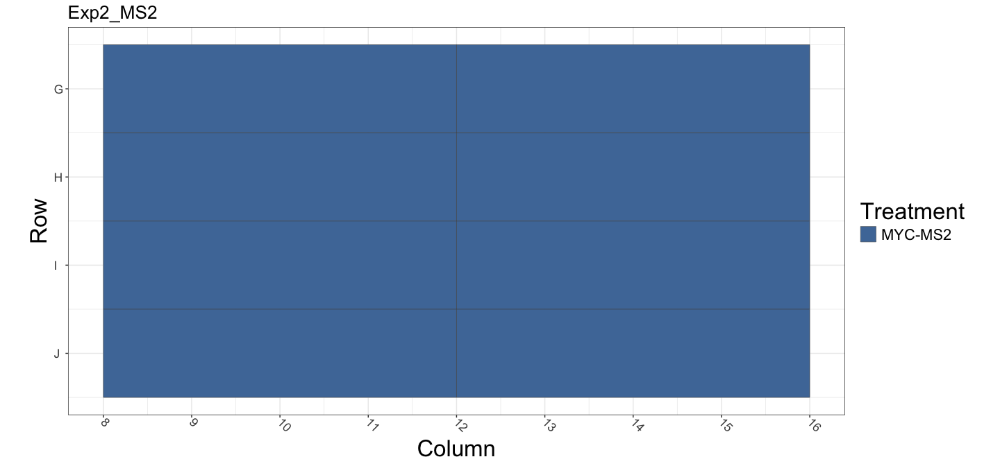
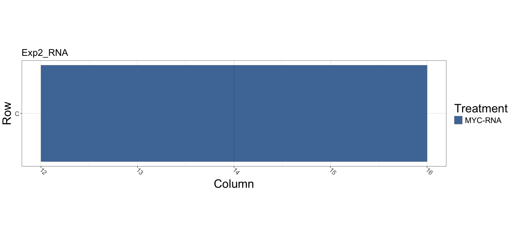
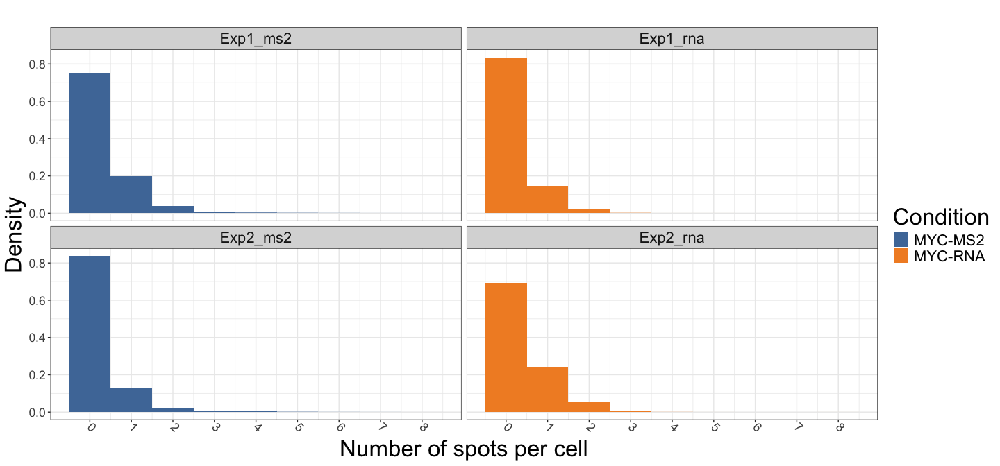
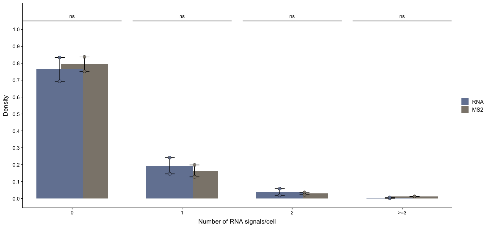

# Figure 1 C: Quantification of MYC nascent RNA signals using DNA/RNA
HiFISH in fixed HBEC cells or a MS2-tagged MYC reporter in living HBEC
cells
Faisal Almansour
January 26, 2026

Analysis setup If you cloned or copied this folder, restore the exact
package versions with: `renv::restore()`

``` r
here::i_am("figure_1_c/260121_RNA_vs_MS2_activity.qmd")
```

    here() starts at /Users/pegorarog/Documents/manuscript_repos/mistelilab-tad-ge

``` r
library(tidyverse)
```

    ── Attaching core tidyverse packages ──────────────────────── tidyverse 2.0.0 ──
    ✔ dplyr     1.1.4     ✔ readr     2.1.6
    ✔ forcats   1.0.1     ✔ stringr   1.6.0
    ✔ ggplot2   4.0.1     ✔ tibble    3.3.1
    ✔ lubridate 1.9.4     ✔ tidyr     1.3.2
    ✔ purrr     1.2.1     

    ── Conflicts ────────────────────────────────────────── tidyverse_conflicts() ──
    ✖ dplyr::filter() masks stats::filter()
    ✖ dplyr::lag()    masks stats::lag()
    ℹ Use the conflicted package (<http://conflicted.r-lib.org/>) to force all conflicts to become errors

``` r
library(data.table)
```


    Attaching package: 'data.table'

    The following objects are masked from 'package:lubridate':

        hour, isoweek, isoyear, mday, minute, month, quarter, second, wday,
        week, yday, year

    The following objects are masked from 'package:dplyr':

        between, first, last

    The following object is masked from 'package:purrr':

        transpose

``` r
library(here)
library(fs)
library(ggthemes)
library(conflicted)
conflicts_prefer(dplyr::filter, dplyr::lag, dplyr::select)
```

    [conflicted] Will prefer dplyr::filter over any other package.
    [conflicted] Will prefer dplyr::lag over any other package.
    [conflicted] Will prefer dplyr::select over any other package.

``` r
set.seed(1234)
```

Adjust and standarize figures width and height

Plot text size settings, set the relative size for all the fonts in all
the plots. A value of 1 keeps is as it is. Values \> 1 make fonts
larger. Value \< 1 make fonts smaller. Play around with it.

``` r
new_size <- 1.5
```

Image acquisition and analysis conditions Specify x,y pixel size
(microns) and z-step (microns).

``` r
xy_res <- 0.108
z_step <- 0.1
```

Read the metadata

``` r
metadata_index <- tibble::tibble(
  experiment = c("Exp1_RNA", "Exp2_RNA", "Exp1_MS2", "Exp2_MS2"),
  metadata_path = here::here(
    "figure_1_c",
    "layouts",
    c(
      "exp1_rna_layout.txt",
      "exp2_rna_layout.txt",
      "exp1_ms2_layout.txt",
      "exp2_ms2_layout.txt"
    )
  )
)

read_one_md <- function(exp_label, md_path) {
  readr::read_tsv(md_path, show_col_types = FALSE) %>%
    dplyr::mutate(experiment = exp_label)
}

md_tbl <- purrr::map2_dfr(
  metadata_index$experiment,
  metadata_index$metadata_path,
  read_one_md
) %>%
  dplyr::filter(!is.na(treat)) %>%
  dplyr::mutate(
    treat = factor(treat),
    treat_conc = factor(treat_conc, levels = sort(unique(treat_conc))),
    row = as.character(row),
    column = as.character(column),
    experiment_key = tolower(experiment)
  )

md_tbl_join <- md_tbl %>%
  dplyr::distinct(experiment_key, row, column, .keep_all = TRUE) %>%
  dplyr::select(experiment_key, row, column, treat, treat_conc)
```

### Plates layout








Read object-level data

``` r
data_index <- tibble::tibble(
  experiment = c("Exp1_ms2", "Exp2_ms2", "Exp1_rna", "Exp2_rna"),
  data_path = here::here(
    "figure_1_c/",
    "data",
    c("exp1_ms2", "exp2_ms2", "exp1_rna", "exp2_rna")
  )
)
stopifnot(all(fs::dir_exists(data_index$data_path)))
```

Set `glob` patterns for directory searches for cell level data and spot
data,resepectively. The spot level data is stored in a single .csv file
per well where all the spots in all the channels are stored. Read and
process the cell-level data. Filter nuclei that are irregularly shaped
(`solidity`) and that are too small (`area`).

``` r
cell_tbl <- data_index %>%
  dplyr::mutate(
    cell_csvs = purrr::map(
      data_path,
      ~ fs::dir_ls(.x, recurse = TRUE, glob = "*well_nuclei_results/*.csv")
    )
  ) %>%
  tidyr::unnest(cell_csvs, names_repair = "unique") %>%
  dplyr::rename(file_name = cell_csvs) %>%
  dplyr::mutate(
    data = purrr::map(file_name, ~ data.table::fread(.x) |> tibble::as_tibble())
  ) %>%
  tidyr::unnest(data) %>%
  dplyr::rename(x = `centroid-0`, y = `centroid-1`) %>%
  dplyr::select(
    experiment,
    column,
    row,
    field_index,
    time_point,
    cell_index,
    x:solidity
  ) %>%
  dplyr::mutate(
    row = as.character(row),
    column = as.character(column),
    experiment_key = tolower(experiment)
  ) %>%
  dplyr::filter(solidity >= 0.95, area >= 10) %>%
  dplyr::arrange(experiment, column, row, field_index, time_point, cell_index)
```

Read the spot-level CSVs (compact, per-experiment folders) Convert the
x, y and z coordinates to microns (They were originally calculated in
pixels) and filter spots that do not belong to any nucleus. These have a
`cell_index` value of `0`.

``` r
spot_tbl <- data_index %>%
  dplyr::mutate(
    spot_csvs = purrr::map(
      data_path,
      ~ fs::dir_ls(.x, recurse = TRUE, glob = "*well_spots_locations/*.csv")
    )
  ) %>%
  tidyr::unnest(spot_csvs, names_repair = "unique") %>%
  dplyr::rename(file_name = spot_csvs) %>%
  dplyr::mutate(
    data = purrr::map(file_name, ~ data.table::fread(.x) |> tibble::as_tibble())
  ) %>%
  tidyr::unnest(data) %>%
  dplyr::rename(
    spot_index_raw = V1,
    x = x_location,
    y = y_location,
    z = z_location
  ) %>%

  dplyr::mutate(
    x_mic = x * xy_res,
    y_mic = y * xy_res,
    z_mic = z * z_step
  ) %>%

  dplyr::filter(cell_index != 0) %>%
  dplyr::mutate(
    row = as.character(row),
    column = as.character(column),
    experiment_key = tolower(experiment)
  ) %>%
  dplyr::select(
    experiment,
    file_name,
    column,
    row,
    field_index,
    time_point,
    cell_index,
    spot_index_raw,
    channel,
    mean_intensity,
    x,
    y,
    z,
    x_mic,
    y_mic,
    z_mic
  ) %>%
  dplyr::arrange(
    experiment,
    column,
    row,
    field_index,
    time_point,
    cell_index,
    channel
  ) %>%
  dplyr::group_by(
    experiment,
    row,
    column,
    field_index,
    time_point,
    cell_index,
    channel
  ) %>%
  dplyr::mutate(spot_index = dplyr::row_number()) %>%
  dplyr::ungroup()

spot_tbl <- spot_tbl %>%
  dplyr::mutate(
    experiment_key = tolower(experiment),
    row = as.character(row),
    column = as.character(column)
  )
```

Use the `spot_tbl` to calculate the number of spots per cell in each
color.

``` r
cell_n_spots_tbl <- spot_tbl %>%
  dplyr::group_by(
    experiment_key,
    row,
    column,
    field_index,
    time_point,
    cell_index,
    channel
  ) %>%
  dplyr::summarise(n = dplyr::n(), .groups = "drop") %>%
  tidyr::pivot_wider(
    names_from = channel,
    names_prefix = "n_spots_channel_",
    values_from = n,
    values_fill = 0
  )

cell_counts <- cell_tbl %>%
  dplyr::left_join(
    cell_n_spots_tbl,
    by = c(
      "experiment_key",
      "row",
      "column",
      "field_index",
      "time_point",
      "cell_index"
    )
  ) %>%
  dplyr::left_join(md_tbl_join, by = c("experiment_key", "row", "column")) %>%
  dplyr::filter(!is.na(treat))
```

### Histograms, MYC nascent RNA signals using DNA/RNA HiFISH in fixed HBEC cells or a MS2-tagged MYC reporter in living HBEC cells



Combine Exp1 + Exp2 and classify 0/1/2/≥3

Summary statistics and Wilcoxon tests

``` r
summary_stats <- freq_by_rep %>%
  dplyr::group_by(ms2_status, assay_type) %>%
  dplyr::summarise(
    n_reps = dplyr::n(),
    mean_freq = mean(freq, na.rm = TRUE),
    median_freq = median(freq, na.rm = TRUE),
    sd_freq = stats::sd(freq, na.rm = TRUE),
    .groups = "drop"
  )

mw_results <- freq_by_rep %>%
  dplyr::filter(assay_type %in% c("RNA", "MS2")) %>%
  dplyr::group_by(ms2_status) %>%
  dplyr::summarise(
    p_value = tryCatch(
      stats::wilcox.test(
        freq[assay_type == "RNA"],
        freq[assay_type == "MS2"]
      )$p.value,
      error = function(e) NA_real_
    ),
    .groups = "drop"
  ) %>%
  dplyr::mutate(
    significance = dplyr::case_when(
      is.na(p_value) ~ "NA",
      p_value < 0.001 ~ "***",
      p_value < 0.01 ~ "**",
      p_value < 0.05 ~ "*",
      TRUE ~ "ns"
    )
  )
```

### Numerical summaries (Mean, SD, Median, IQR) and statistical tests

``` r
replicate_table <- freq_by_rep %>%
  dplyr::group_by(assay_type, experiment) %>%
  dplyr::mutate(total_cells_per_exp = sum(cells)) %>%
  dplyr::ungroup() %>%
  dplyr::arrange(assay_type, experiment, ms2_status)

knitr::kable(
  replicate_table,
  caption = "Replicate-level counts and frequencies per assay and category",
  digits = c(0, 0, 0, 3)
)
```

| assay_type | experiment | ms2_status | cells | freq | total_cells_per_exp |
|:-----------|:-----------|:-----------|------:|-----:|--------------------:|
| MS2        | Exp1_ms2   | 0          | 73329 |    1 |               97511 |
| MS2        | Exp1_ms2   | 1          | 19336 |    0 |               97511 |
| MS2        | Exp1_ms2   | 2          |  3605 |    0 |               97511 |
| MS2        | Exp1_ms2   | \>=3       |  1241 |    0 |               97511 |
| MS2        | Exp2_ms2   | 0          | 58128 |    1 |               69442 |
| MS2        | Exp2_ms2   | 1          |  8894 |    0 |               69442 |
| MS2        | Exp2_ms2   | 2          |  1540 |    0 |               69442 |
| MS2        | Exp2_ms2   | \>=3       |   880 |    0 |               69442 |
| RNA        | Exp1_rna   | 0          | 13110 |    1 |               15721 |
| RNA        | Exp1_rna   | 1          |  2293 |    0 |               15721 |
| RNA        | Exp1_rna   | 2          |   298 |    0 |               15721 |
| RNA        | Exp1_rna   | \>=3       |    20 |    0 |               15721 |
| RNA        | Exp2_rna   | 0          |  9992 |    1 |               14416 |
| RNA        | Exp2_rna   | 1          |  3485 |    0 |               14416 |
| RNA        | Exp2_rna   | 2          |   840 |    0 |               14416 |
| RNA        | Exp2_rna   | \>=3       |    99 |    0 |               14416 |

Replicate-level counts and frequencies per assay and category

``` r
summary_stats <- freq_by_rep %>%
  dplyr::group_by(ms2_status, assay_type) %>%
  dplyr::summarise(
    n_reps = dplyr::n(),
    mean_freq = mean(freq, na.rm = TRUE),
    median_freq = median(freq, na.rm = TRUE),
    sd_freq = stats::sd(freq, na.rm = TRUE),
    se_freq = dplyr::if_else(n_reps > 1, sd_freq / sqrt(n_reps), NA_real_),
    .groups = "drop"
  )

knitr::kable(
  summary_stats,
  caption = "Summary statistics per assay and category (across replicates)",
  digits = c(0, 0, 0, 3, 3, 3)
)
```

| ms2_status | assay_type | n_reps | mean_freq | median_freq | sd_freq | se_freq |
|:-----------|:-----------|-------:|----------:|------------:|--------:|--------:|
| 0          | MS2        |      2 |     0.795 |       0.795 |   0.060 |       0 |
| 0          | RNA        |      2 |     0.764 |       0.764 |   0.100 |       0 |
| 1          | MS2        |      2 |     0.163 |       0.163 |   0.050 |       0 |
| 1          | RNA        |      2 |     0.194 |       0.194 |   0.068 |       0 |
| 2          | MS2        |      2 |     0.030 |       0.030 |   0.010 |       0 |
| 2          | RNA        |      2 |     0.039 |       0.039 |   0.028 |       0 |
| \>=3       | MS2        |      2 |     0.013 |       0.013 |   0.000 |       0 |
| \>=3       | RNA        |      2 |     0.004 |       0.004 |   0.004 |       0 |

Summary statistics per assay and category (across replicates)

``` r
mw_results <- freq_by_rep %>%
  dplyr::mutate(
    ms2_status = factor(ms2_status, levels = c("0", "1", "2", ">=3")),
    assay_type = factor(assay_type, levels = c("RNA", "MS2"))
  ) %>%
  dplyr::group_by(ms2_status) %>%
  dplyr::summarise(
    n_RNA = sum(assay_type == "RNA"),
    n_MS2 = sum(assay_type == "MS2"),
    p_value = tryCatch(
      stats::wilcox.test(
        x = freq[assay_type == "RNA"],
        y = freq[assay_type == "MS2"],
        exact = FALSE
      )$p.value,
      error = function(e) NA_real_
    ),
    .groups = "drop"
  ) %>%
  dplyr::mutate(
    p_adj = p.adjust(p_value, method = "BH"),
    significance = dplyr::case_when(
      is.na(p_value) ~ "NA",
      p_value < 0.001 ~ "***",
      p_value < 0.01 ~ "**",
      p_value < 0.05 ~ "*",
      TRUE ~ "ns"
    )
  ) %>%
  dplyr::arrange(ms2_status)

knitr::kable(
  mw_results,
  caption = "Wilcoxon (RNA vs MS2) for each category (0, 1, 2, ≥3) using per-experiment frequencies",
  digits = c(0, 0, 3, 3),
  align = "lrrr"
)
```

| ms2_status | n_RNA | n_MS2 | p_value | p_adj | significance |
|:-----------|------:|------:|--------:|:------|-------------:|
| 0          |     2 |     2 |   0.699 | 1     |           ns |
| 1          |     2 |     2 |   0.699 | 1     |           ns |
| 2          |     2 |     2 |   1.000 | 1     |           ns |
| \>=3       |     2 |     2 |   0.245 | 1     |           ns |

Wilcoxon (RNA vs MS2) for each category (0, 1, 2, ≥3) using
per-experiment frequencies

``` r
summary_with_p <- summary_stats %>%
  dplyr::left_join(mw_results, by = "ms2_status") %>%
  dplyr::arrange(ms2_status, assay_type)

knitr::kable(
  summary_with_p,
  caption = "Summary statistics + Wilcoxon results (RNA vs MS2) per category",
  digits = c(
    n_reps = 0,
    mean_freq = 3,
    median_freq = 3,
    sd_freq = 3,
    se_freq = 3,
    n_RNA = 0,
    n_MS2 = 0,
    p_value = 3,
    p_adj = 3
  )
)
```

| ms2_status | assay_type | n_reps | mean_freq | median_freq | sd_freq | se_freq | n_RNA | n_MS2 | p_value | p_adj | significance |
|:---|:---|---:|---:|---:|---:|---:|---:|---:|---:|---:|:---|
| 0 | MS2 | 2 | 0.795 | 0.795 | 0 | 0 | 2 | 2 | 1 | 0.931 | ns |
| 0 | RNA | 2 | 0.764 | 0.764 | 0 | 0 | 2 | 2 | 1 | 0.931 | ns |
| 1 | MS2 | 2 | 0.163 | 0.163 | 0 | 0 | 2 | 2 | 1 | 0.931 | ns |
| 1 | RNA | 2 | 0.194 | 0.194 | 0 | 0 | 2 | 2 | 1 | 0.931 | ns |
| 2 | MS2 | 2 | 0.030 | 0.030 | 0 | 0 | 2 | 2 | 1 | 1.000 | ns |
| 2 | RNA | 2 | 0.039 | 0.039 | 0 | 0 | 2 | 2 | 1 | 1.000 | ns |
| \>=3 | MS2 | 2 | 0.013 | 0.013 | 0 | 0 | 2 | 2 | 0 | 0.931 | ns |
| \>=3 | RNA | 2 | 0.004 | 0.004 | 0 | 0 | 2 | 2 | 0 | 0.931 | ns |

Summary statistics + Wilcoxon results (RNA vs MS2) per category

``` r
overall_cells_by_category <- freq_by_rep %>%
  dplyr::group_by(assay_type, ms2_status) %>%
  dplyr::summarise(total_cells = sum(cells), .groups = "drop") %>%
  dplyr::arrange(assay_type, ms2_status)

knitr::kable(
  overall_cells_by_category,
  caption = "Total cells by assay and category (pooled Exp1+Exp2)",
  digits = 0
)
```

| assay_type | ms2_status | total_cells |
|:-----------|:-----------|------------:|
| MS2        | 0          |      131457 |
| MS2        | 1          |       28230 |
| MS2        | 2          |        5145 |
| MS2        | \>=3       |        2121 |
| RNA        | 0          |       23102 |
| RNA        | 1          |        5778 |
| RNA        | 2          |        1138 |
| RNA        | \>=3       |         119 |

Total cells by assay and category (pooled Exp1+Exp2)

``` r
overall_cells_by_assay <- freq_by_rep %>%
  dplyr::group_by(assay_type) %>%
  dplyr::summarise(total_cells = sum(cells), .groups = "drop")

knitr::kable(
  overall_cells_by_assay,
  caption = "Total cells by assay (pooled across categories and replicates)",
  digits = 0
)
```

| assay_type | total_cells |
|:-----------|------------:|
| MS2        |      166953 |
| RNA        |       30137 |

Total cells by assay (pooled across categories and replicates)

### Figure 1C



Session info

``` r
sessionInfo()
```

    R version 4.5.2 (2025-10-31)
    Platform: aarch64-apple-darwin20
    Running under: macOS Tahoe 26.2

    Matrix products: default
    BLAS:   /System/Library/Frameworks/Accelerate.framework/Versions/A/Frameworks/vecLib.framework/Versions/A/libBLAS.dylib 
    LAPACK: /Library/Frameworks/R.framework/Versions/4.5-arm64/Resources/lib/libRlapack.dylib;  LAPACK version 3.12.1

    locale:
    [1] en_US.UTF-8/en_US.UTF-8/en_US.UTF-8/C/en_US.UTF-8/en_US.UTF-8

    time zone: America/New_York
    tzcode source: internal

    attached base packages:
    [1] stats     graphics  grDevices datasets  utils     methods   base     

    other attached packages:
     [1] conflicted_1.2.0  ggthemes_5.2.0    fs_1.6.6          here_1.0.2       
     [5] data.table_1.18.0 lubridate_1.9.4   forcats_1.0.1     stringr_1.6.0    
     [9] dplyr_1.1.4       purrr_1.2.1       readr_2.1.6       tidyr_1.3.2      
    [13] tibble_3.3.1      ggplot2_4.0.1     tidyverse_2.0.0  

    loaded via a namespace (and not attached):
     [1] generics_0.1.4     renv_1.1.6         stringi_1.8.7      hms_1.1.4         
     [5] digest_0.6.39      magrittr_2.0.4     evaluate_1.0.5     grid_4.5.2        
     [9] timechange_0.3.0   RColorBrewer_1.1-3 fastmap_1.2.0      rprojroot_2.1.1   
    [13] jsonlite_2.0.0     scales_1.4.0       cli_3.6.5          rlang_1.1.7       
    [17] crayon_1.5.3       bit64_4.6.0-1      withr_3.0.2        cachem_1.1.0      
    [21] yaml_2.3.12        tools_4.5.2        parallel_4.5.2     tzdb_0.5.0        
    [25] memoise_2.0.1      vctrs_0.7.1        R6_2.6.1           lifecycle_1.0.5   
    [29] bit_4.6.0          vroom_1.6.7        pkgconfig_2.0.3    pillar_1.11.1     
    [33] gtable_0.3.6       glue_1.8.0         xfun_0.56          tidyselect_1.2.1  
    [37] knitr_1.51         farver_2.1.2       htmltools_0.5.9    labeling_0.4.3    
    [41] rmarkdown_2.30     compiler_4.5.2     S7_0.2.1          
